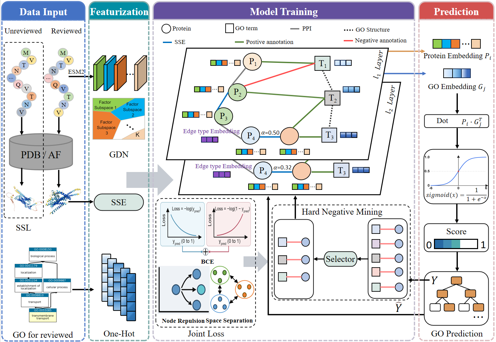

# GPCR-GO

<p align="center">
  
</p>

GPCR-GO is a relation-aware heterogeneous graph learning framework for predicting Gene Ontology (GO) terms of G protein-coupled receptors (GPCRs). This repository contains the training and evaluation code corresponding to our paper **"GPCR-GO: Relation-Aware Graph Learning for Predicting Gene Ontology Terms of G Protein-Coupled Receptors"**.

The model integrates sequence representations, structure-derived similarity, protein-protein interactions (PPIs), GO hierarchy relations, and protein-GO annotations into a unified heterogeneous graph. On top of the graph encoder, GPCR-GO further introduces graph decomposition regularization, semi-supervised learning with unlabeled GPCRs, and hard negative mining to improve prediction under sparse supervision and strong label imbalance.

> Note: this repository focuses on model training/evaluation on the released graph datasets. The raw preprocessing workflow from UniProt/PDB/AlphaFold/STRING to the final graph files is described in the paper, while the released `reviewed5` package already contains the processed inputs expected by the code.

## 1. Highlights

- GPCR-specific heterogeneous graph containing reviewed proteins, unreviewed proteins, and GO term nodes.
- Multi-source biological evidence fusion, including ESM2-based sequence features, DSSP-derived structure similarity, PPIs, and GO graph relations.
- Relation-aware graph attention with edge-type embeddings and relation-specific weighting.
- Hard negative mining and weighted BCE optimization for severe positive/negative imbalance.
- Graph decomposition regularization to encourage complementary factor subspaces.
- CAFA-style evaluation with `Fmax`, `Smin`, and `AUPR`, plus additional metrics implemented in code.

## 2. Repository Structure

| Path | Description |
| --- | --- |
| `methods/model/run.py` | Main training and evaluation script. Includes hard negative mining, weighted BCE loss, factor decomposition regularization, checkpointing, and validation-based early stopping. |
| `methods/model/GNN.py` | GPCR-GO encoder/decoder implementation. Provides the heterogeneous GAT backbone and multiple decoders (`dot`, `distmult`, `bilinear`). |
| `methods/model/conv.py` | Relation-aware graph attention layer with edge-type embeddings and relation-specific attention weights. |
| `methods/model/utils/data.py` | Dataset entry point that loads graph data from the `data/` directory. |
| `scripts/data_loader.py` | Parser for `node.dat`, `link.dat`, and `link.dat.test`. |
| `scripts/Evaluation.py` | Evaluation code for `Fmax`, `Smin`, `AUPR`, ROC-AUC, micro/macro F1, precision, and recall. |
| `methods/model/checkpoint/` | Output directory for saved checkpoints. |
| `assets/model-overview.png` | Model figure used in this README. |

## 3. Environment

The codebase is based on PyTorch and DGL. The paper experiments were run with the following software stack:

- Python 3.8
- PyTorch 1.12.1
- DGL 0.9.1.post1
- NumPy 1.23.5
- SciPy 1.9.3
- NetworkX 2.8.4
- scikit-learn 1.2.0

A minimal environment can be prepared as follows:

```bash
conda create -n gpcr-go python=3.8
conda activate gpcr-go
pip install torch==1.12.1 numpy==1.23.5 scipy==1.9.3 networkx==2.8.4 scikit-learn==1.2.0
pip install dgl==0.9.1.post1
```

If you use a CUDA-enabled environment, please install the PyTorch and DGL builds matching your CUDA version.

## 4. Data

### 4.1 Download

The processed dataset used by this repository can be downloaded from Baidu Netdisk:

- File: `reviewed5.zip`
- Link: [https://pan.baidu.com/s/1DVHG7YZOvE2Ulf5MH51kDg?pwd=18xv](https://pan.baidu.com/s/1DVHG7YZOvE2Ulf5MH51kDg?pwd=18xv)
- Extraction code: `18xv`

### 4.2 Directory Layout

Please unzip the downloaded package into the repository root so that the data are arranged as follows:

```text
GPCR-GO/
├─ data/
│  └─ reviewed5/
│     ├─ bp/
│     │  ├─ node.dat
│     │  ├─ link.dat
│     │  └─ link.dat.test
│     ├─ cc/
│     │  ├─ node.dat
│     │  ├─ link.dat
│     │  └─ link.dat.test
│     └─ mf/
│        ├─ node.dat
│        ├─ link.dat
│        └─ link.dat.test
├─ methods/
├─ scripts/
└─ README.md
```

### 4.3 Input File Format

According to `scripts/data_loader.py`, the released graph package uses the following text formats:

- `node.dat`: `node_id<TAB>node_name<TAB>node_type<TAB>feature`
- `link.dat`: `head_id<TAB>tail_id<TAB>relation_type<TAB>weight`
- `link.dat.test`: `head_id<TAB>tail_id<TAB>relation_type<TAB>weight`

Notes:

- If a node line has only three columns, the loader will treat that node type as featureless and automatically use an identity matrix.
- In the released GPCR datasets, the first node type is used as proteins and the second node type is used as GO terms, which matches the indexing logic in `methods/model/run.py`.
- The `reviewed5` package is already preprocessed. You do not need to run ESM2 or DSSP during training if you directly use the released graph files.

## 5. Quick Start

### 5.1 Train and Evaluate

Please run the commands from `methods/model/` so that the relative data path resolves correctly:

```bash
cd methods/model
python run.py --dataset reviewed5/bp --hardneg
python run.py --dataset reviewed5/mf --hardneg
python run.py --dataset reviewed5/cc --hardneg
```

These commands train and evaluate BP, MF, and CC separately.

### 5.2 What the Main Flags Mean

- `--dataset`: branch-specific dataset under `data/`, for example `reviewed5/bp`.
- `--hardneg`: enables semi-hard negative mining.
- `--neg-ratio`: number of negatives sampled for each positive annotation.
- `--pos-weight`: positive-class weight used in `BCEWithLogitsLoss`.
- `--factor_K`: number of factor subspaces used in graph decomposition.
- `--lambda_c`, `--lambda_i`: weights for the compactness and irrelevance regularizers.

Useful default settings already implemented in code:

- hidden dimension: `64`
- number of layers: `2`
- attention heads: `4`
- edge feature dimension: `32`
- decoder: `dot`
- learning rate: `5e-4`
- batch size: `64`
- dropout: `0.5`
- early stopping patience: `100`

### 5.3 Outputs

During training, the code will:

- save checkpoints to `methods/model/checkpoint/checkpoint_<dataset>_<num_layers>.pt`
- append running logs to `methods/model/training_logs_banjiandu3.jsonl`
- print evaluation metrics to the console after testing

## 6. Hyperparameters Reported in the Paper

In the manuscript, the negative sampling ratio `P_e`, positive weight `P_n`, factor number `M`, and regularization weight `λ` are tuned per GO branch. Their code-level counterparts are:

- `P_e` -> `--neg-ratio`
- `P_n` -> `--pos-weight`
- `M` -> `--factor_K`
- `λ` -> `--lambda_c` and `--lambda_i`

Recommended settings from the paper are summarized below:

| Branch | `--neg-ratio` | `--pos-weight` | `--factor_K` | `--lambda_c` | `--lambda_i` |
| --- | ---: | ---: | ---: | ---: | ---: |
| BP | 15 | 15 | 8 | 0.1 | 0.1 |
| CC | 10 | 15 | 2 | 0.1 | 0.1 |
| MF | 15 | 15 | 4 | 1.0 | 1.0 |

Example commands matching the paper settings:

```bash
cd methods/model
python run.py --dataset reviewed5/bp --hardneg --neg-ratio 15 --pos-weight 15 --factor_K 8 --lambda_c 0.1 --lambda_i 0.1
python run.py --dataset reviewed5/cc --hardneg --neg-ratio 10 --pos-weight 15 --factor_K 2 --lambda_c 0.1 --lambda_i 0.1
python run.py --dataset reviewed5/mf --hardneg --neg-ratio 15 --pos-weight 15 --factor_K 4 --lambda_c 1.0 --lambda_i 1.0
```

Other important paper settings that already match the code defaults include `--hardneg-frac 0.5`, `--hardneg-candK 512`, `--hidden-dim 64`, `--num-layers 2`, and `--num-heads 4`.

## 7. Model-to-Code Mapping

The main modules described in the paper correspond to the implementation as follows:

| Paper module | Code location | Description |
| --- | --- | --- |
| Relation-aware heterogeneous graph attention | `methods/model/conv.py` | Edge-type embedding, relation-specific attention weighting, and multi-head aggregation. |
| Heterogeneous node encoder + dot-product decoder | `methods/model/GNN.py` | Projects protein and GO node features into a shared space and scores protein-GO pairs. |
| Hard Negative Mining (HNM) | `methods/model/run.py` | Selects high-scoring non-positive GO terms from a candidate pool during training. |
| Graph Decomposition Network (GDN) | `methods/model/run.py` | Factorizes node representations and applies compactness/irrelevance regularization. |
| Semi-supervised learning with unreviewed GPCRs | `data/reviewed5/*` + `methods/model/run.py` | Keeps reviewed and unreviewed proteins in one graph while supervising only reviewed protein-GO annotations. |
| Evaluation metrics | `scripts/Evaluation.py` | Computes `Fmax`, `Smin`, `AUPR`, and additional classification metrics. |

## 8. Reported Results

On the held-out test split described in the paper, GPCR-GO achieves the following results:

| GO branch | Fmax | Smin | AUPR |
| --- | ---: | ---: | ---: |
| BP | 0.514 | 13.765 | 0.302 |
| CC | 0.767 | 3.622 | 0.623 |
| MF | 0.631 | 4.572 | 0.575 |

These results indicate that integrating structural similarity, heterogeneous biological relations, graph decomposition, and hard negative mining improves GPCR function prediction under limited supervision.

## 9. Citation

If you find this repository useful in your research, please cite:

```bibtex
@misc{sun2026gpcrgo,
  title={GPCR-GO: Relation-Aware Graph Learning for Predicting Gene Ontology Terms of G Protein-Coupled Receptors},
  author={Sun, Anchi and Hao, Yongjing and Ding, Yijie and Chen, Jing and Wu, Hongjie},
  year={2026},
  note={Manuscript}
}
```

Please replace the citation with the final publication information once the paper is formally published.

## 10. Contact

For questions about the paper or the code, please contact: `hongjiewu@usts.edu.cn`
