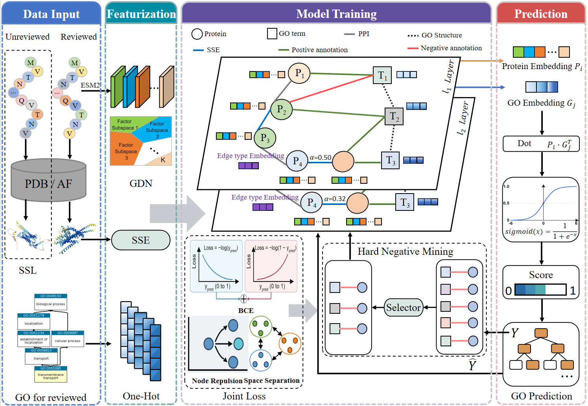

# GPCR-GO

<p align="center">
  
</p>

GPCR-GO is a relation-aware heterogeneous graph learning framework for predicting Gene Ontology (GO) terms of G protein-coupled receptors (GPCRs). This repository contains the training and evaluation code corresponding to our paper **"GPCR-GO: Relation-Aware Graph Learning for Predicting Gene Ontology Terms of G Protein-Coupled Receptors"**.

The model integrates sequence representations, structure-derived similarity, protein-protein interactions (PPIs), GO hierarchy relations, and protein-GO annotations into a unified heterogeneous graph. On top of the graph encoder, GPCR-GO further introduces graph decomposition regularization, semi-supervised learning with unlabeled GPCRs, and hard negative mining to improve prediction under sparse supervision and strong label imbalance.

This repository releases the preprocessed graph datasets used in the manuscript. The raw databases, filtering criteria, and feature-construction procedures for UniProt, GO, BioGRID, PDB, and AlphaFold are described in the Materials and methods section of the paper. The commands below reproduce the training and evaluation workflow from the released preprocessed graph datasets to the main reported metrics.

## 1. Highlights

- GPCR-specific heterogeneous graph containing reviewed proteins, unreviewed proteins, and GO term nodes.
- Multi-source biological evidence fusion, including ESM2-based sequence features, DSSP-derived structure similarity, PPIs, and GO graph relations.
- Relation-aware graph attention with edge-type embeddings and relation-specific weighting.
- Hard negative mining and weighted BCE optimization for severe positive/negative imbalance.
- Uniform graph decomposition regularized to produce complementary factor subspaces.
- CAFA-style evaluation with `Fmax`, `Smin`, and `AUPR`, plus additional metrics implemented in code.

## 2. Environment

The codebase is based on PyTorch and DGL. The paper experiments were run with the following software stack:

- Python 3.8
- PyTorch 1.12.1
- DGL 0.9.1.post1
- NumPy 1.23.5
- SciPy 1.9.3
- NetworkX 2.8.4
- scikit-learn 1.2.0

A minimal CPU environment can be prepared as follows:

```bash
conda create -n gpcr-go python=3.8
conda activate gpcr-go
pip install torch==1.12.1 numpy==1.23.5 scipy==1.9.3 networkx==2.8.4 scikit-learn==1.2.0
pip install dgl==0.9.1.post1
```

The training code supports both CPU and CUDA devices, although CUDA is strongly recommended for full experiments. If you use a CUDA-enabled environment, install the PyTorch and DGL builds matching your CUDA version.

## 3. Quick Start

Run the commands from `methods/model/`:

```bash
cd methods/model
```

Run BP:

```bash
python runepochgpu1_v1_log.py --dataset dataset/bp
```

Run CC:

```bash
python runepochgpu1_v1_log.py --dataset dataset/cc
```

Run MF:

```bash
python runepochgpu1_v1_log.py --dataset dataset/mf
```

The script selects the manuscript hyperparameters from the final `bp`, `cc`, or `mf` component of `--dataset`: BP uses `Pe=15`, `Pn=15`, `M=8`, and `lambda=0.1`; CC uses `Pe=10`, `Pn=15`, `M=2`, and `lambda=0.1`; MF uses `Pe=15`, `Pn=15`, `M=4`, and `lambda=1.0`. Hard negative mining is enabled by default. These values can still be overridden with command-line options.

The main shared defaults are learning rate `5e-4`, weight decay `2e-4`, batch size `64`, dropout `0.5`, maximum epochs `1000`, early-stopping patience `100`, hidden dimension `64`, two graph-attention layers followed by an attention-based output projection, four attention heads per stage, hard-negative fraction `0.5`, hard-negative candidate pool size `512`, and random seed `42`.

## 4. Outputs and Main Metrics

During training, the script writes checkpoints under `methods/model/checkpoint` and appends run metadata to `methods/model/training_logs.jsonl`. 

The terminal output includes CAFA-style metrics, including:

- `fmax`: maximum protein-centric F1 score across thresholds.
- `smin`: minimum semantic distance.
- `aupr`: area under the precision-recall curve.

These are the metrics reported in the main performance table of the manuscript for BP, MF, and CC.

Run the focused GDN tests from the repository root with:

```bash
python -m unittest discover -s tests -p "test_*.py"
```

Because GPU kernels and library versions may introduce small numerical variation, reproduced values can differ slightly across hardware and software builds. The released data, split logic, hyperparameters, and evaluation code are provided to reproduce the reported workflow from the preprocessed graph datasets.
